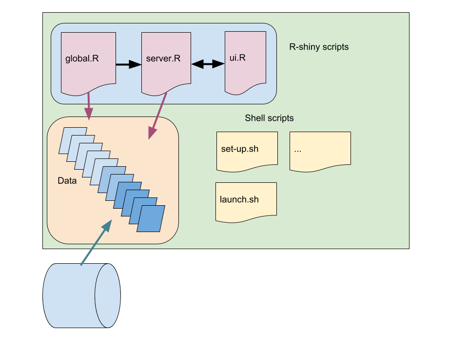

# Welcome
Welcome to the OpenClimateDataPrototype wiki! These pages will hopefully explain what the prototype Prototypeapplication is about and help you to install it on your local computer. One example of the app can be found at this [link](http://ocdp.met.no/). There is also a [screencast (video)](https://youtu.be/iFo4zM-_ljo) that gives a brief tour/demonstration of how to use the app on YouTube.

# Principle
This prototype lets you explore climate data from station records. It starts with an overview of the data and lets you then zoom into location of interest and presents you with a time series. It is designed to be flexible so that it can be applied to anywhere  in the world - based on whatever data file is provided. It tries to be smart so that it extracts information required for the operation from the [netCDF](https://www.unidata.ucar.edu/software/netcdf/) files. It is designed to be fast by only extracting the data it needs at any time (summary statistics, metadata or a chosen time series) from a local netCDF-file (making use of the direct access functionality). The use of local netCDF files also seperates the app from the database, which may be beneficial security-wise. The prototype can run on a local computer or as a web-based service.

Keywords for this prototype are: user-friendliness, flexibility, smart, fast, and secure. However, I don't know how well it scales if there is a massive user demand (needs to be tested).

Below is a schematic that shows the structure of the prototype, with three R-scripts which are the main part of it and how they relate to the data. There are also some shell scripts for assisting the set-up and management of the prototype. The data comprise netCDF files which are supposed to be generated by extracting station data from a database.  

# Description
The prototype is mainly a set of computer code that runs as an R shiny app and extracts information from climate station data stored as netCDF files. The app comes with a set of demonstration data from Met Norway, and is also set up to work with station data from European Climate and assessment Data ([ECA&D](https://www.ecad.eu/dailydata/)) and the Global Historical Climate Network ([GHCN](https://www.ngdc.noaa.gov/docucomp/page?xml=NOAA/NESDIS/NCDC/Geoportal/iso/xml/C00861.xml&view=getDataView&header=none)).

**Metadata** is part of the analysis, and the prototype makes use of the metadata stored in the netCDF file (header as well as as variables) in the smart approach where the files and data are interpreted and visualised.

The engine behind the app is the R-package called `esd` which is available from [github.com/metno/esd](https://github.com/metno/esd).

The prototype is made up of a code part (set-up: global.R; user interface: ui.R; and processing: server.R), a data part, and scripts (*.sh) to update the data and do some house keeping.

Some extra work needs to be done to make this app working with various databases. All that is needed is to read the data from the database into the R environment and use `esd` to save these in the netCDF format (a hybrid CF convention with some extra summary statistics) in the local data folder. This can be set up as a crontab job so that the data is up-to-date on a daily basis. 
### Security
See [Mastering shiny](https://mastering-shiny.org/scaling-security.html).

# Copyright and license

Copyright © 2018-2023 Norwegian Meteorological Institute.

This program is free software; you can redistribute it and/or
modify it under the terms of the GNU General Public License
as published by the Free Software Foundation; either version 2
of the License, or (at your option) any later version.

This program is distributed in the hope that it will be useful,
but WITHOUT ANY WARRANTY; without even the implied warranty of
MERCHANTABILITY or FITNESS FOR A PARTICULAR PURPOSE.  See the
GNU General Public License for more details.

You should have received a copy of the GNU General Public License
along with this program; if not, write to the Free Software
Foundation, Inc., 51 Franklin Street, Fifth Floor, Boston, MA  02110-1301, USA.

## Mail

Meteorologisk institutt
Postboks 43 Blindern
NO-0313 OSLO

## Email

post@met.no

## Website

https://www.met.no
